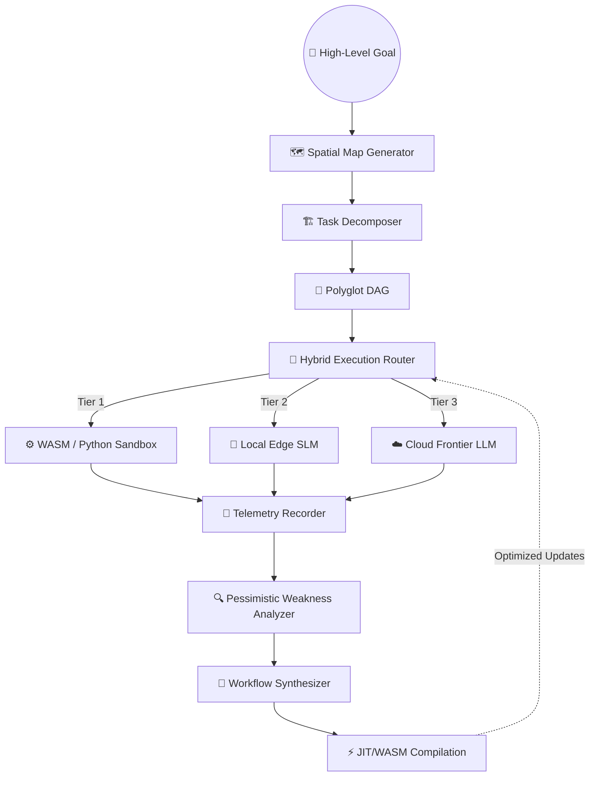

<div align="center">

```text
 ███████╗██╗   ██╗ █████╗     ███████╗ ██╗
 ██╔════╝██║   ██║██╔══██╗    ██╔════╝███║
 █████╗  ██║   ██║███████║    █████╗  ╚██║
 ██╔══╝  ╚██╗ ██╔╝██╔══██║    ██╔══╝   ██║
 ███████╗ ╚████╔╝ ██║  ██║    ███████╗ ██║
 ╚══════╝  ╚═══╝  ╚═╝  ╚═╝    ╚══════╝ ╚═╝
```

# **Eva.E1**
### Self-Optimizing Agentic Memory & Multi-Agent OS

<p>
  
  
  
  
</p>

<p>
  <a href="#-getting-started"><strong>Get Started »</strong></a>
  •
  <a href="#-architecture"><strong>Architecture »</strong></a>
  •
  <a href="#-key-capabilities"><strong>Capabilities »</strong></a>
  •
  <a href="#-core-modules--technical-specifications"><strong>Deep Dive »</strong></a>
</p>

</div>

---

## 🌌 Overview

**Eva.E1** is an autonomous, self-optimizing multi-agent execution and cognitive memory fabric. It acts as an intelligent compiler for AI agents: when encountering recurring textual task patterns, it automatically **synthesizes, validates, optimizes, and compiles** those patterns into high-speed native Python or sandboxed WebAssembly execution pipelines. 

For complex, multi-file software engineering tasks, it provisions a **topologically structured multi-agent workspace** (Manager-Worker architecture) managed by a Unix-like kernel scheduler and guided by a real-time semantic map of the file system.

> 💡 **The Paradigm Shift:** Eva.E1 bypasses the traditional LLM-generation loop for recurring tasks, reducing context window usage by up to **45%** and execution latency by **10x to 100x** through native JIT and WASM compilation.

---

## ✨ Key Capabilities

| Capability | Technical Description |
| :--- | :--- |
| 🧠 **Self-Compiling Workflows** | Translates historical LLM tool execution logs into native Python code, eliminating token costs and reducing execution latency. |
| 🕸️ **Distributed Cognitive Memory** | Uses compact `.ecl` ledgers to pack state representations, and ephemeral Micro-Context Buffers (MCB) for isolated sub-tasks. |
| 🏗️ **Topological Orchestration** | Decomposes high-level software goals into topologically sorted DAGs, spawning specialized, short-lived worker agents. |
| 🗺️ **Spatial Workspace Awareness** | Scans file structures and analyzes code syntax to build a directed graph of imports and containment. |
| 🎯 **Contextual Bandits** | Dynamically determines the most efficient routing tier (Native, Local Edge SLMs, or Cloud Frontier LLMs). |
| 🩺 **Causal Self-Healing** | Leverages Bayesian networks and do-calculus interventions to identify failing nodes, hot-patching code inline via AST rewriting. |
| 🧩 **Isomorphic Graph Matching** | Recognizes structurally identical workflows across different domains, allowing compiled optimizations to be reused globally. |
| 📉 **Concept Drift Mitigation** | Employs Gaussian Mixture Models (GMM) alongside Page-Hinkley statistical checks to detect deviating task patterns. |

---

## 🏛️ Architecture

Eva.E1 routes tasks through a sophisticated pipeline that shifts from dynamic LLM reasoning to compiled execution as patterns emerge, managed by the `NexusKernel` Operating System layer.



---

## 🧬 Core Modules & Technical Specifications

<details>
<summary><strong>1. Hybrid Execution Router & WASM Sandbox</strong></summary>
<br>

The system uses a cost-aware routing utility function to select the most efficient execution tier based on hardware utilization, task complexity, and financial constraints:

$$
\text{Utility}_{\text{Tier}} = w_l \cdot \text{Score}_{\text{Latency}} + w_c \cdot \text{Score}_{\text{Cost}} + w_r \cdot \text{SuccessRate} - \text{Penalty}_{\text{Hardware}}
$$

*   **Tier 1 (Cached/Compiled)**: Bypasses LLM inference entirely. Runs inside the WebAssembly Sandbox (`wasmtime`) to enforce capability-based security, ensuring safe I/O and network boundaries.
*   **Tier 2 (Local Edge SLM)**: Utilizes local small language models to preserve API budgets and latency.
*   **Tier 3 (Cloud Frontier LLM)**: Reserved for highly complex, out-of-distribution tasks.

A **Pareto Optimizer** continually balances these workloads to find the optimal frontier of Latency, Cost, Accuracy, and Energy metrics.

</details>

<details>
<summary><strong>2. Distributed Cognitive Memory Fabric (DCMF)</strong></summary>
<br>

The memory architecture is split into a multi-tenant, hyper-dense ecosystem:

*   **Encapsulated Context Ledger (.ECL)**: A line-oriented, zlib-compressed binary format maximizing token-to-entropy density. It strips syntactic waste (such as JSON brackets, string keys, and spacing) to reduce context usage by up to **45%** compared to standard JSON structures.
*   **Micro-Context Buffers (MCB)**: Ephemeral memory buffers dynamically provisioned for specific sub-tasks. They are hydrated with only the target schemas and failure profiles required, and are automatically dissolved upon task completion to synthesize core insights back to the ledger.
*   **Global Hive Mind**: A centralized shared layer combining Semantic (facts), Procedural (workflows), and Refined Models to eliminate workspace cold-starts.
*   **Dream Engine**: Runs an asynchronous background loop (`Orient`, `Gather`, `Consolidate`, `Prune`) that clusters memory items using Jaccard/Cosine similarity and generates semantic summaries.

```text
[META::SPACE_CORE]
!DOM_KEYS -> ["inventory_api", "auth_v2"]
!SCHEMAS -> {h_ptr_01: "compressed_byte_map"}

[PROCEDURAL_VECTORS]
@OP_01(Read) -> $NODE_REF_99 -> %EXEC_PROFILE_FAST
@OP_02(Filter) -> $NODE_REF_102 -> %EXEC_PROFILE_FAIL_COUNT_0
```

</details>

<details>
<summary><strong>3. Continuous Self-Healing & Causal Debugging</strong></summary>
<br>

*   **Causal Debugging**: Models execution history as a Bayesian network. It uses interventions (do-calculus) to identify the step most likely responsible for the failure:

$$
P(\text{Success} \mid \text{do}(\text{Step}_i = \text{Fixed}))
$$

*   **Speculative Checkpointing**: Serializes state snapshots at DAG node boundaries, enabling step-level rollbacks.
*   **AST Hot-Patching**: Uses an `ASTHotPatcher` to identify compilation or logical errors and injects AST-level Python code modifications to hot-patch failing logic without restarting workflows.

</details>

<details>
<summary><strong>4. Advanced Structural Patterns & Drift Adaptation</strong></summary>
<br>

*   **Isomorphic Data-Flow Graph (DFG) Matching**: Translates text-based workflows into structural DFGs, using NetworkX graph isomorphism to detect when different workspaces solve identical problems under different domains (e.g. filtering a CSV vs filtering an API response).
*   **Concept Drift Mitigation**: Pairs `GaussianMixture` (GMM) models with Page-Hinkley statistical tests to track dropping success rates and changing latent features, triggering adaptation strategies (such as retraining policies or deprecating old workflows).

</details>

<details>
<summary><strong>5. Multi-Agent Workspace Orchestration & OS Kernel</strong></summary>
<br>

*   **NexusKernel**: Functions as an Operating System kernel for agents. Implements Unix-like process management (`fork_agent`, `exec_agent`, `wait_agent`, `kill_agent`) and enforces strict memory/token quotas via a priority queue scheduler.
*   **SpatialContextGenerator**: Rather than passing massive codebases to an LLM, the system generates targeted file system graphs (nodes = files, edges = imports/contains relationships extracted via AST) to drastically focus worker context.
*   **Distributed Actors**: Extends multi-agent execution beyond local limits via a ZeroMQ (ZMQ) and Ray backed asynchronous actor system, permitting zero-copy serialization between independent machines.

```python
# Topological wave execution example
steps = await decomposer.decompose(goal, workspace_map)
sorted_steps = TaskDecomposer.topological_sort(steps)

# Executes parallel waves of independent steps
for wave in execution_waves:
    await asyncio.gather(*[spawn_and_run_worker(step) for step in wave])
```

</details>

---

## 📊 Technical Performance Profile

By shifting from raw LLM orchestration to compiled workflow execution, Eva.E1 drastically improves efficiency across key operating metrics:

| Metric | LLM-Only Orchestration | Eva.E1 Compiled Runtime | Efficiency Gain |
| :--- | :--- | :--- | :--- |
| **P95 Latency** | `1500ms - 5000ms` | `10ms - 150ms` | 🚀 **10x - 100x reduction** |
| **Token Consumption** | `4000 - 8000 tokens / task` | `0 tokens (compiled path)` | 💸 **100% reduction on hot paths** |
| **Memory Density** | JSON Overhead (`100%`) | ECL Compact Binary | 📦 **45% context compression** |
| **Recovery Overhead** | Full pipeline restart | Speculative step-level rollback | 🛡️ **Node-level isolation** |

---

## 🚀 Getting Started

### Prerequisites
*   Python 3.12+
*   SQLite3
*   ZeroMQ (for distributed actor communication)
*   `wasmtime` (optional, for sandboxed execution)

### Installation

1. **Clone the repository**
   ```bash
   git clone https://github.com/your-repo/Eva.E1.git
   cd Eva.E1
   ```

2. **Install dependencies**
   ```bash
   pip install -r requirements.txt
   ```

3. **Initialize storage directories**
   ```bash
   mkdir -p nexus_data/telemetry.db nexus_data/dag_state nexus_cache
   ```

### Verification Demos

The repository includes demonstration scripts to verify the core systems:

```bash
# 1. Verify the Self-Optimizing Brain
# Showcases repetitive pattern detection, synthesis, and latency/token reduction.
python examples/optimization_demo.py

# 2. Verify the Workspace OS
# Scans local directories, builds dependency graphs, and spawns context-isolated workers.
python examples/manager_demo.py
```

---

## 📂 Directory Structure

<details>
<summary><strong>Click to expand the full architectural map</strong></summary>
<br>

```text
Eva.E1
├── 🤖 agents/                      # Unified Agent Interfaces
│   ├── base_agent.py               # Abstract agent contract with quota controls
│   ├── distributed_actors.py       # Distributed execution actor model (ZMQ transport)
│   ├── manager_instance.py         # Parent manager instance
│   └── worker_instance.py          # Short-lived, focused task worker
├── 🔌 api/                         # Operational API Endpoints
│   └── workspace_api.py            # API layer for querying filesystem graphs
├── ⚙️ config/                      # System Thresholds & Parameters
│   ├── settings.py                 # Sandbox profiles, operations lists, and configurations
│   └── thresholds.py               # Optimization triggers and efficiency metrics
├── 🧠 core/                        # Primary Cognitive Routines
│   ├── agent_brain.py              # Central agent brain and background optimization loops
│   └── memory_types.py             # Unified models for tasks, workflows, and metrics
├── ⚡ execution/                    # Multi-Tier Execution Runtimes
│   ├── checkpoint_engine.py        # Speculative checkpoints & live AST hot-patching
│   ├── hybrid_router.py            # Hardware/cost-aware routing matrix
│   ├── orchestrator.py             # Executable coordinator for tools & compiled code
│   ├── profiler.py                 # Telemetry metrics collection
│   └── wasm_runtime.py             # Capability-safe WebAssembly compiler (wasmtime)
├── 📈 learning/                     # Meta-Learning & Self-Correction Pipeline
│   ├── causal_debugger.py          # Bayesian graph debugging & do-calculus diagnostics
│   ├── dfg_pattern_matcher.py      # NetworkX data-flow graph isomorphic matcher
│   ├── drift_adapter.py            # GMM density estimation & Page-Hinkley drift adapter
│   ├── feedback_processor.py       # Execution signal extraction & efficiency scoring
│   ├── implicit_feedback.py        # User diff parse engine
│   ├── meta_controller.py          # Contextual bandit for optimization strategies
│   ├── pattern_engine.py           # Siamese Sentence-Transformer similarity maps
│   ├── reflection_engine.py        # Case-based reasoning & episodic replays
│   ├── strategy_learner.py         # Multi-armed bandit routing optimizer
│   └── workflow_refiner.py         # Self-healing LLM feedback refinement
├── 🌱 maturation/                  # Layered Workflow Upgrades
│   └── pipeline.py                 # Logical-to-physical DAG pipeline (L1 to L4)
├── 💾 memory/                      # Storage Abstractions & Layers
│   ├── layers/                     # Interfaces for tasks, tools, and workflows
│   ├── retrieval/                  # Semantic querying and trace matching
│   └── stores/                     # Physical backends (ChromaDB, NetworkX, LRU TTL)
├── 🌌 nexus_agent/                 # Cognitive Memory Fabric (DCMF)
│   ├── dcmf/                       # Encapsulated Context Ledgers & MCB managers
│   ├── evolution/                  # 8-stage evolution loops & cryptographically signed repos
│   ├── memory/                     # Multi-tier memory (Hot, Warm, Cold storage)
│   ├── os/                         # Unix-like process kernel and supervisor
│   ├── security/                   # Sandbox isolation manager
│   └── utils/                      # Token and cost budget enforcement
├── 🏗️ orchestration/               # Topological Multi-Agent Coordinators
│   ├── manager_agent.py            # Planner, executor, and worker manager
│   ├── polyglot/                   # Multi-language parallel wave runners
│   ├── task_decomposer.py          # Topological project planning and step sorting
│   └── worker_factory.py           # Specialized worker prompt synthesis
├── 🔍 pwa/                         # Vulnerability & Bottleneck Profiling
│   └── analyzer.py                 # Pessimistic Weakness Analyzer (PWA)
└── 🗂️ workspace/                   # Spatial Codebase Graphing
    ├── code_analyzer.py            # Static AST imports and complexity parser
    ├── filesystem_graph.py         # Directed graph mapping contains/imports relations
    └── spatial_context.py          # Focused workspace subgraph builder
```

</details>

---

<div align="center">
  <sub>Built with ❤️ and advanced cognitive architectures.</sub>
  <br>
  <sub>Eva.E1 is open-source software licensed under the Apache License 2.0.</sub>
</div>
